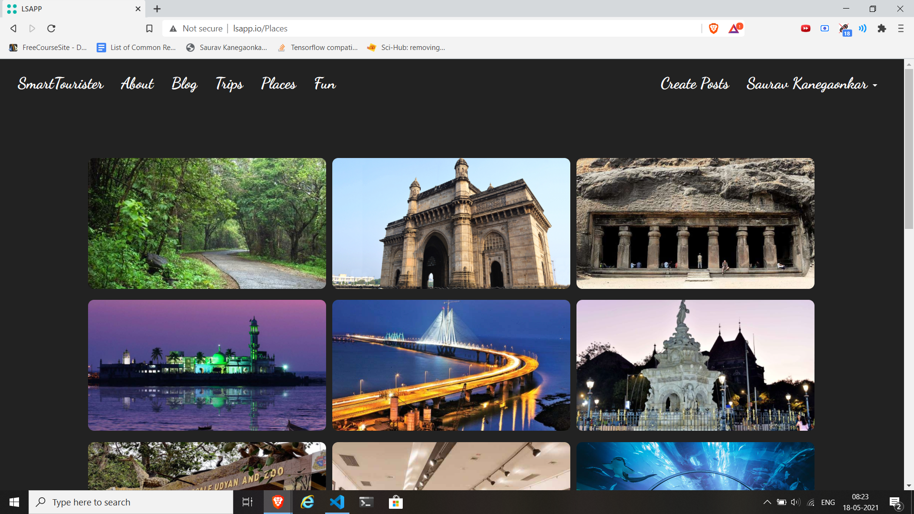

# Intelligent Tourism
  
The main idea of this project is to design a system that will run on most of phones and palms and will be helpful when visiting some new places and cities. This system will be able to find a route using user criteria. It will also be able to estimate time needed to travel from one object to the next and if it is possible, advise which bus line or other public means of transport may be used. It should be helpful for people that want to visit a city without having much information about it.

The system does the following things:
1. Determination of important and necessary places for tourism in that city
2. Determination of the optimum plan for sightseeking places
3. Determination of the shortest distance between the selected places
4. Allow people to posts blogs about their trip.
5. Choose between system made trips.

## Running the website

1. Create a database in [phpMyAdmin](http://localhost/phpmyadmin/server_databases.php) called "lsapp" and import the lsapp.sql there.
2. Watch this video for [Environment Setup & Laravel Installation](https://www.youtube.com/watch?v=H3uRXvwXz1o&list=PLillGF-RfqbYhQsN5WMXy6VsDMKGadrJ-&index=2). **Please** follow the whole video and not just the environment setup. For those who don't have any idea what laravel/php is and how you run laravel framework websites, I would suggest to watch 5-6 videos of this [playlist](https://www.youtube.com/playlist?list=PLillGF-RfqbYhQsN5WMXy6VsDMKGadrJ-) because you will encounter many errors as it is a bit complicated process.
Note that you name our website ending with .io and not .dev , example: what we have used is lsapp.io
3. Clone this repository in the htdocs folder.
4. Rename `.env.example` file as `.env`. Here there are 3 empty variables which should be filled with api keys.

    a) GOOGLE_MAPS_API_KEY =  Go to [Google cloud console](https://console.cloud.google.com/projectselector2/home/dashboard?supportedpurview=project) and create a new project. After then go to APIs & Services from the side navbar and click on ENABLE APIS AND SERVICES. Search for Maps JavaScript API and enable it. Click on Credentials from the side navbar and copy the key(after configuring the OAuth consent screen).

    b) MAPQUEST_API_KEY = [Register](https://developer.mapquest.com/user/me/apps) here and copy paste the key here.

    c) DISTANCE_MATRIX_API_KEY = [Register](https://admin.distancematrix.ai/main/usage) here and apply for the free trial. Note that normal gmail ids wont work for registration, you should have some organization email id or college email id.
5. Type `lsapp.io` in your browser url and run.

## Algorithm used for determination of the shortest distance

### Travelling Salesman Problem using Branch and Bound Approach in PHP

    The sales person needs to visit some cities or places. we had to plan him routes, from house to house. the shorter route would be good. we can solve this by TSP algorithm. we could take him places as latitudes and longitudes. from this locations details, we can generates a possible ways matrix. then we can apply the TSP for this matrix to find a path. i just converted the algorithm from a CPP code. By this way, we can be found the least cost of travel or distance or time. here i used distance matrix to find shorter route

For the code we referred to this [website](https://ideone.com/0TBgxr).

 

## Screenshots

1. Login 

  

2. Register

  

3. Landing Page

  

4. About Page

  

5. List of places

  

6. Trips page: Here select Mumbai as we only have those places in database :P.

  

7. After clicking submit button you'll be displayed lists of all the places in google maps(for which you should have the api key) and in a nice grid format. Click on the checkbox for those places which you want to include in your trip. Please remember that **do not select places more than 5**. Don't forget to add your address otherwise it would give an error.

  

8. You can click on the places to view information about it.

  

9. After clicking the Proceed button you will be shown a map with all the places on it and the best route between them. Your address will be the starting and the ending point of the trip. At the end you shown some system made trips.

  

10. You can create blogs and format according to you. You can also view other people's blogs.

  

11. The project ends here. You can check out the fun page xD.
